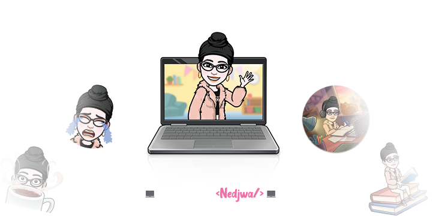

<h1  color="pink">
        𝐇𝐞𝐥𝐥𝐨, &lt;𝚌𝚘𝚍𝚎𝚛𝚜/&gt;!
  
</h1>

Hello, I am Nedjwa, a full stack Developer. I love learning new languages and implementing them in various projects. Currently engrossed with Frontend and hoping to learn a lot more!:smile:
 

<h2 > About Me :woman:</h2>

- 🔭 Master's degree in network and distributed systems from university Constantine 2, Algeria
- 🌱 I’m currently Full time Student at [@microverse](https://www.microverse.org/).
- 💻 I’m currently leveling up my javascript skills.
- 🖌 I'm a UI/UX Designer , i like playing with colors and shapes.
- ♥  I'm in love with everything has relation to Tech and Design..
- 👯 I’m looking to collaborate on new Projects.
- 💬 Talk to me about  Problem solving,JavaScript,Freelancing Opportunites, Open Source and Design.

<h2 > Skills  </h2>

 
  
  
  
  
  
  
  
  

<h2 > Connect with me  </h2>

 
 
   

 
|              |                                                                                                            |
| --------------------------------------------------------------------------------------------------------------------------------- | ----------------------------------------------------------------------------------------------------------------------------------------------------------------------------------------------------------------- |
|  | 

-------
